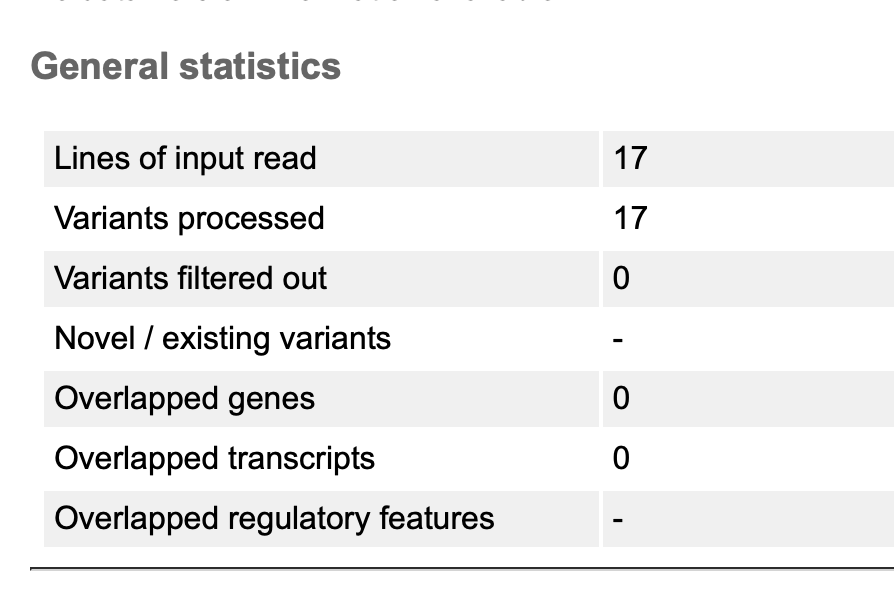
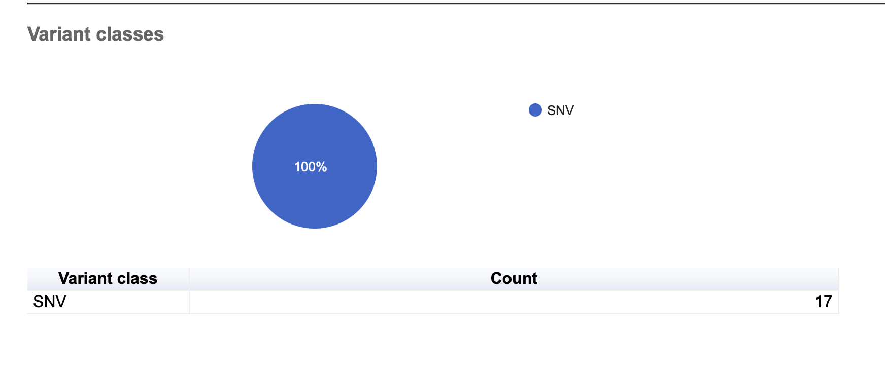
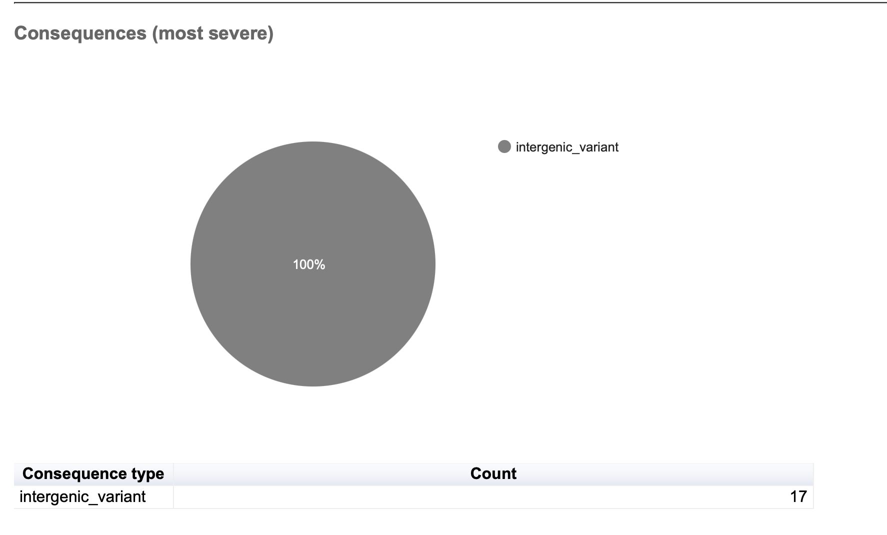
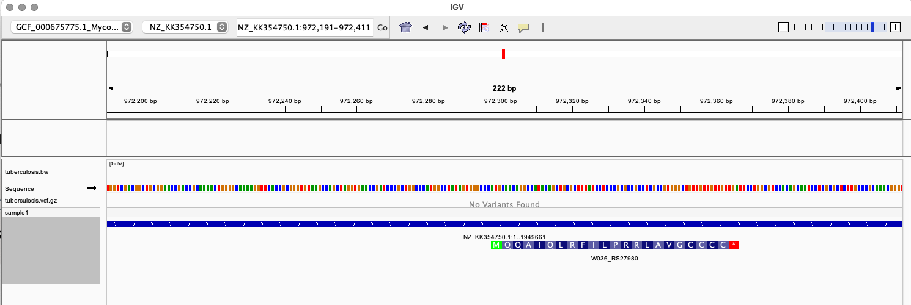
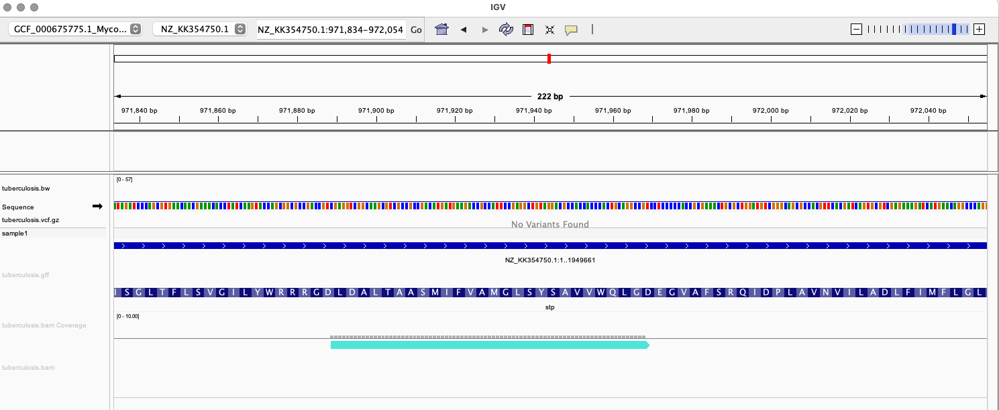
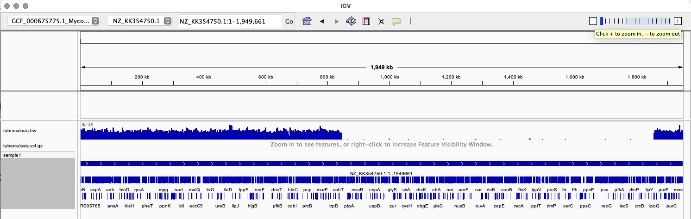

## Week 11: Variant Effect Predition (VEP)

To execute the `Makefile.mk` run the following command:
```
make -f Makefile.mk all
```
### VEP Result
17 variants were processed in the genome *Mycobacterium tuberculosis (TB RSA126)*.



100% of the variants were SNV (single nucleotide variation) or SNP. 

The SNP is due to intergenic variant meaning change in the nucelotide sequence in the region between gene loci. This mutation most likely have not affected translation and the resulting protein integreity. 


### Visualization
Given that the genome size of TB is small, I had to manuver the zoom a lot to capture the data.

Here is the IVG view with coding region


one example where the mutation is


Coverage
