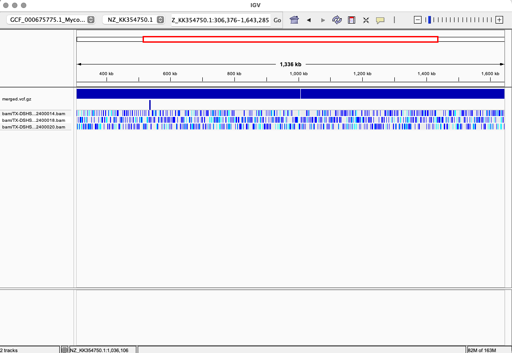

## Week 12: Automate VCF Pipeline
Created the `design.csv` file using the following commands:
```
bio search PRJNA1080563 -H --csv > design.csv && awk -F, 'NR==1 || $14 == "PAIRED"' design.csv | head -n 4 > design.csv
```
Note: There were couple samples that were single end reads so had to filter out for the `design.csv`

To execute the pipeline with the Variant Calling `Makefile.mk`, run the following command:
```
cat design.csv | head -5 | \
    parallel --lb -j 4 --colsep , --header : \
    make all SRR={run_accession} SAMPLE={library_name}
```
### Verify Variant Caller's result
To identify variants of interest in the VCF file, I ran the following command to show the first 5 variants.
```
gunzip -c merged.vcf.gz | grep -v '^##' | head -n 5
```
Output:
```
#CHROM	POS	ID	REF	ALT	QUAL	FILTER	INFO	FORMAT	bam/TX-DSHS-MTB-2400014.bam	bam/TX-DSHS-MTB-2400018.bam	bam/TX-DSHS-MTB-2400020.bam
NZ_KK354750.1	34	.	C	T	10.7923	.	SGB=-0.379885;MQ0F=0;MQ=40;DP=2;DP4=0,0,1,0;AD=0,1;AN=6;AC=2	GT:PL:DP:SP:ADF:ADR:AD:GQ	0/0:.:.:.:.:.:.:.	0/0:.:.:.:.:.:.:.	1/1:40,3,0:1:0:0,1:0,0:0,1:127
NZ_KK354750.1	35	.	G	A	10.7923	.	SGB=-0.379885;MQ0F=0;MQ=40;DP=2;DP4=0,0,1,0;AD=0,1;AN=6;AC=2	GT:PL:DP:SP:ADF:ADR:AD:GQ	0/0:.:.:.:.:.:.:.	0/0:.:.:.:.:.:.:.	1/1:40,3,0:1:0:0,1:0,0:0,1:127
NZ_KK354750.1	40	.	C	T	10.7923	.	SGB=-0.379885;MQ0F=0;MQ=40;DP=2;DP4=0,0,1,0;AD=0,1;AN=6;AC=2	GT:PL:DP:SP:ADF:ADR:AD:GQ	0/0:.:.:.:.:.:.:.	0/0:.:.:.:.:.:.:.	1/1:40,3,0:1:0:0,1:0,0:0,1:127
NZ_KK354750.1	43	.	C	G	10.7923	.	SGB=-0.379885;MQ0F=0;MQ=40;DP=2;DP4=0,0,1,0;AD=0,1;AN=6;AC=2	GT:PL:DP:SP:ADF:ADR:AD:GQ	0/0:.:.:.:.:.:.:.	0/0:.:.:.:.:.:.:.	1/1:40,3,0:1:0:0,1:0,0:0,1:127
```
### Merged VCF discussion
1. **Low QUAL and DP**:
All variants have QUAL=10.7923 and very low read depth (DP=2), making them candidates for false positives.

2. **Per-Sample Data**:
Two of the samples (bam/TX-DSHS-MTB-2400014.bam and bam/TX-DSHS-MTB-2400018.bam) show no evidence of the alternate allele (0/0).
Only bam/TX-DSHS-MTB-2400020.bam shows 1/1 genotypes but with very low depth (DP=1).
3. **Shared Properties**:
All variants have the same mapping quality (MQ=40) and similar INFO values, suggesting these might have been called in the same low-confidence region.

### Filter Low-Quality Variants
I used the following command to exclude variants wtih `QUAL < 20` or `FMT/DP < 10`
```
bcftools filter -e 'QUAL < 20 || FMT/DP < 10' merged.vcf.gz > low_quality.vcf
```
To count how many variants there are 
```
grep -v '^#' low_quality.vcf | wc -l
```
resulting in __9035__ variants.
### Filter High-Quality Variants
Used the following command to extract variants with `QUAL >= 20`
```
bcftools filter -i 'QUAL >= 20 && FMT/DP >= 10' merged.vcf.gz > high_quality.vcf
```
To count how many variants are high quality
```
grep -v '^#' high_quality.vcf | wc -l
```
which yield __512__ variants.

### IGV view 
The cyan color bars indicate possible SNPs, bases differeing from reference genome.

