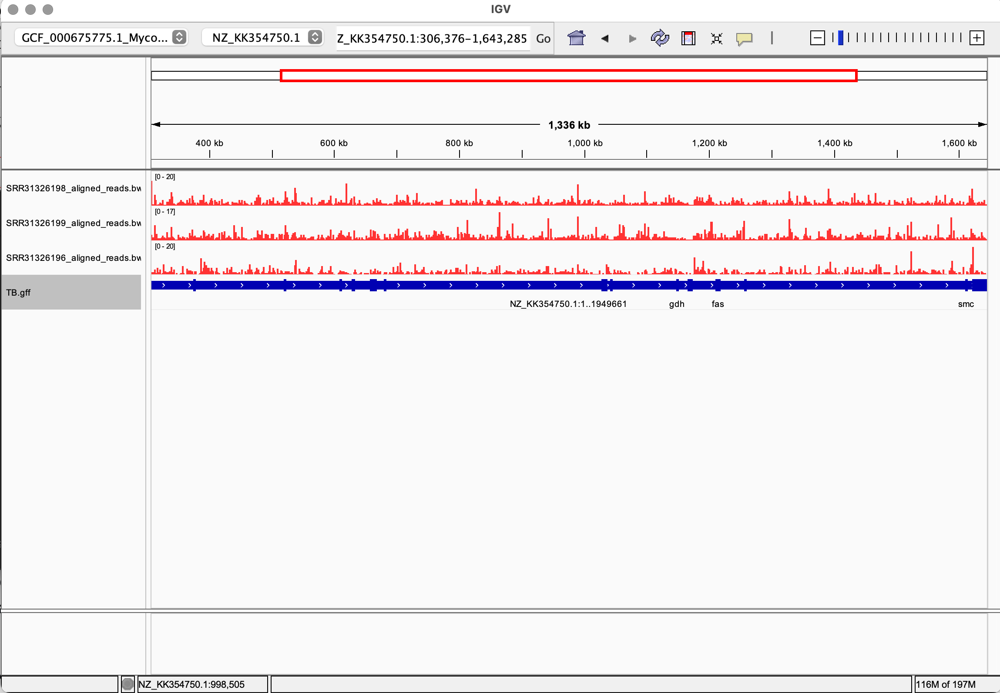

## Week 13: Generating RNA-seq Count Matrix

The script will automate downloading reference genome to indexing with HiSat2

Use the following command to donwload the RNA-seq data using the SRR accession numbers

```
cat design.csv | parallel --lb -j 10 --colsep , --header : make -f Makefile.mk reads SRR={SRR}
```

To individually all the process use the command below:
```
cat design.csv | parallel --lb -j 10 --colsep , --header : make -f Makefile.mk reads SRR={SRR}
```
In the `Makefile.mk` we use bigwig to create coverage file and index using the `bamCoverage`

## Create RNA-seq Count Matrix
To create the count matrix run the following command:
```
featureCounts -a TB.gff -o TB_matrix.txt *.bam
```
### Result

Visualizing the aligned RAN-seq files in IGV:


### Count
Some interesting thing I found from RNA-seq count:

* SRR31326196 had 186 reads were assigned 
* SRR31326196 had 657 reads that were unmapped
* SRR31326196 had 18,265 reads that had no features

Number of `Assigned` reads is relatively low compared to `Unassigned_NoFeatures` suggesting that most reads mapped to the regions were not annotated in the `TB.gff`.

Makes sense because these RNA-seq reads were from an experiment that were treated with some chemicals and the researchers wanted to see the its effects. 
